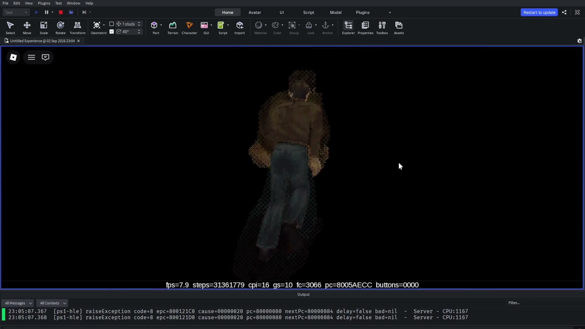
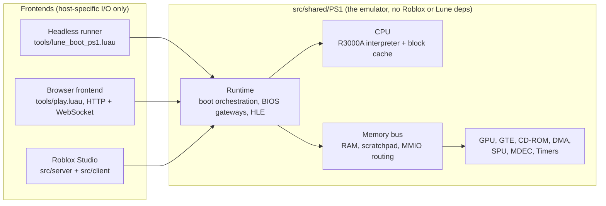
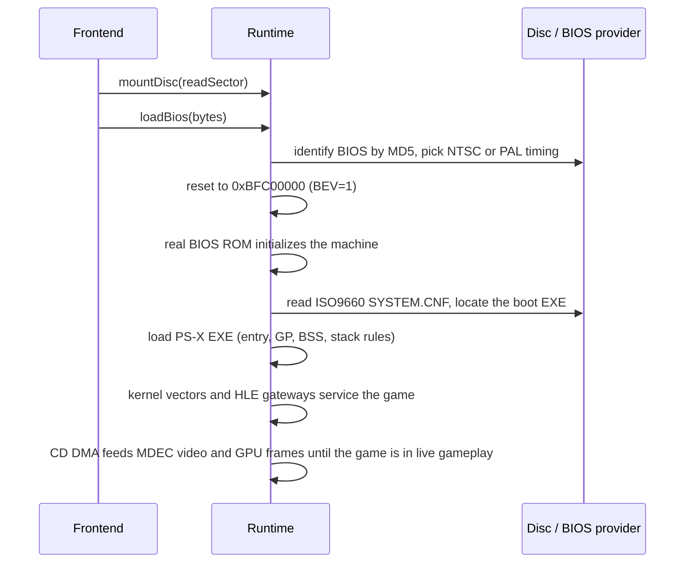

<div align="center">

# ps1-luau

**A PlayStation 1 emulator written in Luau**, the scripting language behind Roblox. It has a MIPS R3000A interpreter, a software GPU, and a CD-ROM / DMA / SPU device set, and it boots real PS1 games from the command line, in a browser, and inside Roblox Studio.



</div>

**Silent Hill** (`SLUS-0707`) is the game it's tested against, booted from an `SCPH1001` BIOS into live gameplay. The screenshot above was taken in the Roblox Studio frontend. Booting into the game takes a while at interpreter speed, so a headless boot check exists to test the same path without a screen.

> This is a hobby project. It is not cycle-accurate, and Silent Hill is the only game tuned so far. That one game boots through the real BIOS and CD path, and it plays.

**Reading guide:** [Quick start](#quick-start) runs the emulator. [What is implemented](#what-is-implemented) and [Architecture](#architecture) describe the machine. [Testing and verification](#testing-and-verification) is the short version, [docs/testing.md](docs/testing.md) has the full details, and [Repository layout](#repository-layout) maps the repo.

---

## Quick start

> [!IMPORTANT]
> You need a legally obtained PS1 BIOS and disc image before anything will run. Defaults are `the-ultimate-playstation-1-bios/SCPH1001.BIN` for the BIOS and `SLUS-0707.BIN` for the disc (a raw 2352-byte-sector image; the `.cue` is optional). Both files are ignored by Git. Do not add copyrighted BIOS, game, or checkpoint data to the repository.

```bash
# 1. install the pinned toolchain (Rojo 7.7.0, Lune 0.10.5)
aftman install

# 2. launch the browser frontend with a cold BIOS boot (no checkpoints needed)
lune run tools/play.luau 8890 clean
```

Open <http://127.0.0.1:8890/>. Expect a black screen with the HUD counting up while the BIOS initializes. This is the slow part of a cold boot. The runtime then loads the game through the real disc path or its built-in fallback, and frames stream to the browser over WebSocket either way. If you have `sh_gs_n.bin` checkpoints from a previous run, `lune run tools/play.luau 8890 menu` resumes at the Silent Hill main menu and skips the wait.

### Run it in a browser (Lune)

```text
lune run tools/play.luau [port] [checkpoint] [cpi] [mix]
```

- `port` defaults to `8890`.
- `checkpoint` is `clean` (cold BIOS boot), `menu` (resumes `checkpoints/sh_gs_7.bin`; the default), or a path to any checkpoint file.
- `cpi` is cycles per emulated instruction. Default `64`. Lower values are slower but matter when input timing is being checked. The Roblox runtime uses `16`.
- `mix` (`1`/`0`) turns on SPU mixing. It's experimental, and with no audio sink it only costs CPU.

The Lune frontends read the default disc and BIOS paths from `tools/lib/boot.luau`. The headless runner can point elsewhere with `--disc-bin` and `--bios`, and the Roblox server serves whatever image you give it. Only Silent Hill is a supported target so far, but the runtime is built so other games can exercise it too.

The page renders frames at a pixelated 2x scale with a HUD status line showing `fps`, emulated `steps`, `cpi` and, for Silent Hill, `gs` (a game state value) and `fc` (frame counter), plus the current `pc`. WebSocket delivery keeps running while the tab is hidden.

One resource note: the Lune frontends load the whole disc image into memory (roughly 590 MB for `SLUS-0707.BIN`), so give the process headroom. The Roblox path streams sectors over HTTP instead, and caches only what the game has actually read.

### Run it in Roblox Studio

The Rojo project ([`default.project.json`](default.project.json)) maps the shared core into `ReplicatedStorage`, the emulator server into `ServerScriptService`, and the framebuffer/input client into `StarterPlayerScripts`.

Start the local asset server. Roblox cannot read local files, so it fetches sectors, the BIOS, and checkpoints over HTTP:

```bash
python tools/disc_server.py \
  SLUS-0707.BIN \
  --bios the-ultimate-playstation-1-bios/SCPH1001.BIN
```

It serves on `http://127.0.0.1:8080` and accepts any disc image path you point it at. See `--help` for `--port`, `--host`, and `--checkpoints-dir`. A `.cue` argument resolves to its first `FILE`. Then:

```bash
aftman run rojo build -o ps1.rbxlx
```

Open `ps1.rbxlx` in Studio, enable **Game Settings > Security > Allow HTTP Requests**, and press **Play**. The server waits for the asset server, loads the BIOS and disc, and cold-boots every time: BIOS-first boot, then a direct executable boot if the BIOS path stalls (8 s without CD activity). No checkpoint files are needed or consulted; passing `resume=true` is the only way to load the highest available `sh_gs_n.bin` checkpoint instead. `ps1.rbxlx` is ignored by Git.

From the client command bar:

```lua
shared.PS1BootFromDisc()      -- cold boot (BIOS, then EXE fallback)
shared.PS1BootFromDisc(nil, true)  -- same, but resume the newest sh_gs_n.bin checkpoint first
shared.PS1Stop()              -- stop emulation
```

The remotes `PS1BootFromDiscRemote`, `PS1BiosBootRemote`, `PS1LoadDiscRemote`, `PS1LoadBiosRemote`, `PS1StopRemote`, `PS1StateRemote`, `PS1CapabilitiesRemote`, and `PS1RunCpuTestRemote` expose the same operations, plus CPU/register/CD-ROM state probes. For example, dump the live machine state from the client command bar:

```lua
local s = game:GetService("ReplicatedStorage"):WaitForChild("PS1StateRemote"):InvokeServer()
print(s.pc, s.status, s.cd.readActive, s.cd.currentLba, s.cd.dataFifo)
```

Frames are packed server-side into an RGBA byte string (the same wire format as the browser frontend) and written to an `EditableImage`. The server throttles frame broadcasts to one per 0.1 s, so the Studio display tops out near 10 fps even when emulation runs faster.

### Headless boot check

A no-display runner boots the BIOS, watches for CD activity and GPU frame flips, and prints an evidence-based `PASS`/`FAIL` verdict:

```bash
lune run tools/lune_boot_ps1.luau \
  --disc-cue SLUS-0707.CUE \
  --bios the-ultimate-playstation-1-bios/SCPH1001.BIN \
  --seconds 10
```

<details>
<summary>Full option reference</summary>

```text
  --disc-cue <path>                  Path to CUE file (default: SLUS-0707.CUE)
  --disc-bin <path>                  Path to BIN file (overrides CUE parsing)
  --bios <path>                      Path to BIOS ROM (default: the-ultimate-playstation-1-bios/SCPH1001.BIN)
  --seconds <n>                      Wall-clock emulation duration (default: 10)
  --slice-instructions <n>           Instruction budget per run slice (default: 50000)
  --bios-probe-seconds <n>           BIOS-first probe window before fallback (default: 3)
  --cpu-cycles-per-instruction <n>   Cycles advanced per CPU step (default: 1)
  --force-direct-boot-fallback       Always fall back to direct EXE boot if the BIOS probe has no CD activity
  --trace-cdrom | --trace-bios | --trace-interrupts   Enable tracing
  --dump-final-state                 Dump registers and surrounding words at exit
  --help                             Show usage
```

</details>

There is also a small dispatcher: `lune run tools/run.luau list` (`boot | play | md5 | refcheck | cpudiff | gtediff | gpudiff`).

## Controls

PS1 digital pad mapping (the same in the browser and Roblox Studio frontends):

| PS1 button | Keyboard |
|---|---|
| D-pad | Arrows / WASD |
| Cross | `X`, `J`, `K` |
| Circle | `C`, `L` |
| Triangle | `T`, `Y` |
| Square | `V`, `U` |
| Start | Enter |
| Select | Backspace |
| L1 / R1 | `Q` / `E` |
| L2 / R2 | `1` / `3` |

## What is implemented

The core in `src/shared/PS1` is 16,848 lines of host-agnostic Luau (about 33,300 lines counting everything under `src/` and `tools/`).

| Component | Status | Highlights |
|---|---|---|
| CPU | Implemented | MIPS R3000A interpreter with branch delay slots, load delays, unaligned `LWL`/`LWR` and `SWL`/`SWR`, COP0 exceptions, interrupt delivery, COP2 access, and 32-bit overflow behavior, plus an optional decoded block cache |
| GTE | Implemented | COP2 geometry/lighting pipeline: the hardware UNR reciprocal approximation, MAC overflow flags, the MVMVA translation quirk |
| Memory bus | Implemented | 2 MB RAM mirror window, scratchpad, BIOS mirrors, expansion regions, cache control, MMIO routing, SIO (pads and memory cards), bus-error behavior |
| GPU | Implemented | Software rasterizer: 1024x512 15-bit VRAM, GP0/GP1 command set, textured and shaded primitives, CLUTs, texture windows, semi-transparency, dithering, drawing masks, VRAM copies, CPU/VRAM transfers, display timing |
| CD-ROM | Implemented | Full register map, command/response FIFOs, drive state machine (seek / spin-up / speed change), sector timing on the real 33.8688 MHz clock, sub-Q synthesis, data-sector buffering, DMA delivery, interrupt queues, filtering, mode 2/XA routing |
| SPU | Implemented | 24-voice ADPCM synthesizer: Gaussian interpolation, ADSR envelopes, volume sweeps, noise, capture buffers, reverb, transfer FIFO, CD mixing |
| MDEC | Implemented | Quantization tables, run-length-coded DCT blocks, IDCT, YUV conversion, DMA input/output |
| Timers | Implemented | Three timers on the system clock with dot-clock/HBlank/VBlank gates, target and overflow behavior, edge-triggered interrupts |

Core files map one-to-one to the components above (`CPU.luau`, `GTE.luau`, `Memory.luau`, `GPU.luau`, `CDROM.luau`, `DMA.luau`, `SPU.luau`, `MDEC.luau`, `Timers.luau`), joined by `BIOS.luau`, `Region.luau`, `Ckpt.luau` (checkpoint serializer), `Runtime.luau` (boot and HLE orchestration), `Harness.luau`, `Disc.luau` (ISO9660 boot-EXE location), `PSXExe.luau` (PS-X EXE loading), `FrameOut.luau` (frame wire encoding), `Hud.luau` (frontend HUD state), and `Util.luau` (MD5, base64, and bit helpers). Modules are single files running from a few hundred to a few thousand lines. The CD-ROM controller is the largest at 2,843.

## Architecture



The devices hang off the memory bus, and each frontend only supplies I/O: a `readSector(lba)` closure for the disc, a framebuffer sink, and input. Disc access is deliberately abstract, so the Lune frontends read a local `.bin` straight off disk while Roblox fetches base64 sectors from the Python server.

The CPU's decoded block cache is an optimization, not a different execution model. Blocks stop around branches, exceptions, BIOS gateways, and wherever the runtime must regain control, and RAM writes carry page versions so self-modifying code invalidates stale blocks. The baseline interpreter stays as the reference for debugging instruction behavior.

## Boot path



A BIOS boot is not just "put bytes in RAM and jump to the executable." Region detection uses a pure-Luau MD5 and a lookup table transcribed from DuckStation, because PAL and NTSC units have different frame timing and the same core must serve both. If the BIOS path stalls with no CD activity, the runtime falls back to a direct PS-X EXE boot, which is useful for debugging but is not a replacement for the real path. The BIOS-first handoff, where the real kernel yields to the game's CD loader, is the most timing-sensitive stretch of the whole project and the place where cold boots stall most often. The headless boot check exists to catch exactly that.

The runtime contains a deliberately small amount of HLE: selected BIOS gateways, console output, critical-section syscalls, exception recovery for bare executable boots, and the interrupt/vsync behavior the target needs. When a BIOS is loaded, the real BIOS and RAM-resident kernel handle their own calls. Mixing half of a real BIOS with half of an HLE implementation is a good way to create bugs that look like hardware faults.

## Why Luau

This started as a hardware experiment and gradually became an emulator for retail software. Writing a PS1 emulator in Luau is a way to learn exactly how much of the machine you can reconstruct when every layer (CPU, bus, DMA, GPU, CD-ROM, SPU) has to be justified by real software actually running. Doing it in Luau was apparently not questionable enough.

Luau gives this project bitwise operators, tables, coroutines, and a Roblox runtime, then asks you to emulate 64-bit arithmetic with numbers that are only reliably exact up to 2^53. Multiplication is split into 16-bit halves through an exact `mult64` that reconstructs the full 64-bit product. Signed division gets its own truncation helper. And `bit32` will happily truncate an intermediate value at the worst possible moment. Silent Hill's stream-cipher CD decryption multiplies around 2^62 values on every decrypted word.

The Roblox host cannot open a BIOS or a ~590 MB disc image, hence the Python asset server. The Lune frontend uses a custom module loader and direct file access instead. Luau's portability story is mostly a series of increasingly specific adapters. The payoff is one core that runs everywhere, so a bug in the CPU or a device is reproducible in a browser with a framebuffer and in a headless runner with printed state around the same execution point.

## Testing and verification

The emulator is checked against separately written reference models and literal-pixel oracles. This section is the quick version. The [contributor guide](docs/testing.md) explains how each gate is built and what it has caught. Everything below runs from the repository root. The headless boot check is the only gate that needs a copyrighted BIOS and disc image (see [Quick start](#headless-boot-check)). The rest run on the checked-in code with no assets.

| Gate | Run it | What it guards |
|---|---|---|
| Headless boot check | `lune run tools/lune_boot_ps1.luau --disc-cue SLUS-0707.CUE --bios <bios> --seconds 10` (see [Quick start](#headless-boot-check)) | the full BIOS to gameplay boot path. Run after timing, CPU, DMA, or BIOS path changes |
| CPU harness | Roblox: `shared.PS1RunCpuTestAndPrint()` | built-in base64 test executables (`AccessTime`) under an instruction budget |
| Reference-model drift check | `lune run tools/run.luau refcheck` | every named constant matches between core and reference (105 constants, 9 pairs) |
| Deep CPU differential | `lune run tools/run.luau cpudiff` | per-instruction CPU state and stores across three engines: 20 hand-assembled programs, encoding pins, decoder fuzz |
| GTE differential | `lune run tools/run.luau gtediff` | GTE execution and register transfers (about 15,000 commands and 1,100 transfers) |
| GPU differential | `lune run tools/run.luau gpudiff` | GPU command streams and VRAM, plus 16 literal-pixel oracles |
| Checkpoint round-trips | `Ckpt.save` / `Ckpt.load` | the versioned `PS1CKPT1` snapshot format (v15) across the full machine state |
| Independent reference models | `tools/*_ref.luau` | separate CPU/memory/GPU/GTE/CD-ROM/DMA/MDEC/SPU/XA/timers/interrupts/pads/memcard implementations the differentials compare against |

After changing the CPU, timing, DMA, GPU, or the BIOS path, run the differentials and the headless boot check again. On a PS1, a timer change can turn into a CD bug several minutes later.

## Repository layout

- `src/shared/PS1`: the emulator core plus the executable harness.
- `src/shared/PS1/TestRoms`: base64-embedded test executables for the harness.
- `src/server` / `src/client`: the Roblox host and framebuffer display.
- `tools/play.luau`: the browser frontend (HTTP + WebSocket).
- `tools/lune_boot_ps1.luau`: the headless boot check.
- `tools/run.luau`: dispatcher for `boot | play | md5 | refcheck | cpudiff | gtediff | gpudiff`.
- `tools/md5.luau` and [`tools/lib/disasm.luau`](tools/lib/disasm.luau): the MD5 utility and MIPS disassembler that back the command-line tools and region identification.
- `tools/lib`: Lune bootstrap ([`boot.luau`](tools/lib/boot.luau), [`ps1loader.luau`](tools/lib/ps1loader.luau), [`discbin.luau`](tools/lib/discbin.luau)) and MIPS disassembly helpers.
- `tools/*_ref.luau`: independent reference models.
- `tools/disc_server.py`: serves BIOS, disc sectors, and checkpoints to Roblox.
- `checkpoints/`: fast-resume checkpoints (gitignored; served by `disc_server.py`).
- `showcase/`: poster frame of the Roblox Studio frontend.
- `docs/testing.md`: the contributor deep dive behind [Testing and verification](#testing-and-verification).
- [`default.project.json`](default.project.json): Rojo place layout; [`aftman.toml`](aftman.toml) pins Rojo and Lune.

## Known limits

- Single-threaded interpreter and a Luau-table rasterizer. The showcase capture in the hero ran about 7-8 fps at 1080p with `cpi=16` on its machine. The headless runner sustained roughly half a million emulated instructions per second at `cpi=1` on the same machine.
- Device timing is batched into steps. DMA has documented simplifications (cycle stealing, synchronous transfers), and several DMA channels are missing.
- Some BIOS functions are unsupported and fall back to HLE.
- CD/XA audio reaches the SPU state, but no frontend has a finished audible output path.
- The Roblox display depends on Studio's `EditableImage` APIs, which vary by build.

## Roadmap

- **Audible audio**: a real host sink for the SPU mixer.
- **More DMA channels**: the biggest gap between playing one game and playing many.
- **More retail targets**: each new game is a test suite that grows the BIOS/gateway HLE.
- **More CPU test ROMs**: the harness and `TestRoms/` layout make instruction-level tests cheap to add.
- **CI**: a GitHub Actions workflow ([`.github/workflows/ci.yml`](.github/workflows/ci.yml)) runs refcheck, the CPU/GTE/GPU differentials, and a Rojo build on every push and PR. The headless boot check needs a copyrighted BIOS and disc image, so it stays a manual gate.

## Troubleshooting & FAQ

<details>
<summary><strong>Black screen in Roblox?</strong></summary>

Check the server output first (open **View > Output** in Studio). The emulator may still be booting, waiting on CD activity, or unable to use `EditableImage` in the current Studio build. Confirm the disc server is reachable (`curl http://127.0.0.1:8080/health`) and that **Allow HTTP Requests** is enabled.

</details>

<details>
<summary><strong>How do I know it is actually working?</strong></summary>

The server Output window gives the ground truth. Working signs, in order: `PS1 runtime initialized`, `disc server reachable - auto-booting`, `connecting to disc server: http://127.0.0.1:8080`, `disc mounted: <n> sectors`, `BIOS loaded: 524288 bytes`, then `checkpoint resume disabled for this boot; cold booting from disc` (or `resumed checkpoint sh_gs_<n>.bin (gs=<n>)` when booted with `resume=true`), then `BIOS loaded; starting BIOS-first disc boot`, possibly followed by `BIOS boot appears stalled (no CD activity); falling back to direct executable boot`. On screen, the HUD should show `fps` above zero with `gs` climbing from the boot state to 7 (main menu) and 11 (in-game) while `fc` increments. Frames with a climbing `gs` mean success. A frozen `pc` with a running `steps` counter is an infinite loop worth reporting.

</details>

<details>
<summary><strong>The boot check prints FAIL. Is the emulator broken?</strong></summary>

Not necessarily. Read the EVIDENCE and BLOCKER lines. `cdActivity=false` with zero CD-ROM MMIO counts means the run ended before the BIOS reached the disc, usually because the window was too short. `fallback=true` means the run switched to the direct EXE path, which exercises the core but not the CD handoff. Missing pad or input-acceptance evidence means the run never reached a state where the game polls the controller. Extend `--seconds` and `--bios-probe-seconds` to push deeper, or compare the lines against a known-good run. A FAIL that names a concrete BLOCKER is the best bug report this project has.

</details>

<details>
<summary><strong>Boot stalls with no CD activity?</strong></summary>

The runtime falls back to a direct EXE boot after 8 seconds. If that also fails, probe the live state with the `PS1StateRemote` snippet in [Run it in Roblox Studio](#run-it-in-roblox-studio) (watch CD-ROM `readActive`, `currentLba`, and FIFO depths) and check the disc server logs.

</details>

<details>
<summary><strong>Input feels dead or taps get missed?</strong></summary>

`cpi` matters. At 64 cycles/instruction the game's pad edge/click detection can miss taps, which is why the Roblox runtime pins 16. Pass a lower `cpi` (for example `16`) to `tools/play.luau`.

</details>

<details>
<summary><strong>Checkpoint won't load?</strong></summary>

`PS1CKPT1` snapshots are versioned. A `bad magic` or `unsupported version` error means the file predates or postdates the current format (`VERSION` in `Ckpt.luau`). Regenerate it or boot `clean`.

</details>

<details>
<summary><strong>Can I run other PS1 games?</strong></summary>

Only Silent Hill has been tuned so far, but the core is designed to be exercised by other games. Point the frontends at your own files and see how far you get. The browser defaults live in `tools/lib/boot.luau`, the headless runner takes `--disc-bin` and `--bios`, and `disc_server.py` serves any image you give it. Format rules: the Roblox and browser frontends need raw 2352-byte `.bin` images, the headless runner also attempts 2048-byte images, and `.chd` works nowhere. Boot `clean` with a new title, since Silent Hill checkpoints will not transfer to it. If a game misbehaves, debug with the CPU harness and test ROMs before blaming the game.

</details>

<details>
<summary><strong>Corrupted CD data after a "fast-path" change?</strong></summary>

The data path is deliberately lazy. Sectors are delivered only when the game programs its DMA buffers, and draining the CD FIFO early feeds the loader garbage that makes it re-read the same sectors forever. Keep the data path lazy.

</details>

<details>
<summary><strong>Why does a timer fix break CD reading minutes later?</strong></summary>

Because that is how the PS1 works. Device timing is coupled through shared interrupts and DMA, and the headless boot check is the sanity net. Run it before trusting a local-looking fix.

</details>

## Contributing

The most useful thing you can do is make the headless boot check or a checkpoint round-trip fail, then fix it, or land a fix and show the check still passes. Before opening a PR:

1. `aftman install`
2. Run the headless boot check ([above](#headless-boot-check)) and compare the verdict and evidence lines with the previous run.
3. Add or update a test where the change touches CPU, timing, DMA, or the BIOS path.

Keep copyrighted BIOS, disc, and checkpoint data out of the repository. It is gitignored for a reason.

## Acknowledgments

- **[DuckStation]**: timing formulas, the BIOS region-identification table, and SPU/GPU behavioral references transcribed into this codebase.
- **[psx-spx]** and the PS1 hardware docs community: the register-level reference material the implementations are checked against.
- **[Rojo]** and **[Lune]**: the toolchain that lets one Luau core run in Roblox and on the command line.

[DuckStation]: https://github.com/stenzek/duckstation
[psx-spx]: https://psx-spx.consoledev.net/
[Rojo]: https://rojo.space/
[Lune]: https://lune-org.github.io/docs

## Legal

This is an independent hobby emulator with **no BIOS, game, or checkpoint data** in the repository. Those are provided locally by you and ignored by Git. Distributing copyrighted ROM images, BIOS files, or game assets is your responsibility. The repository is licensed under the [MIT License](LICENSE); the code is provided as-is for learning.
